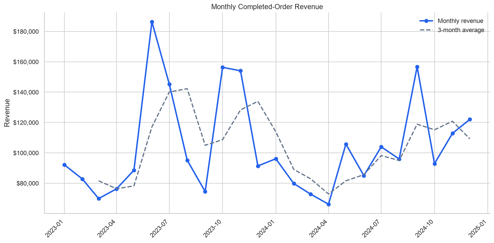
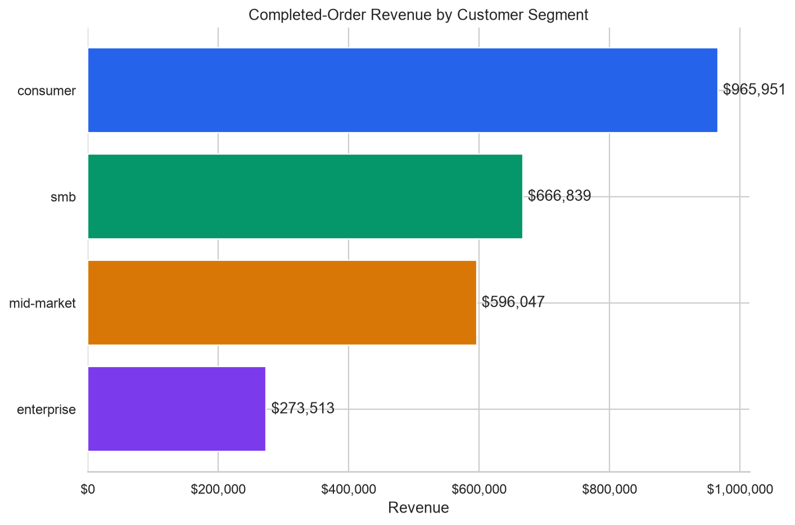
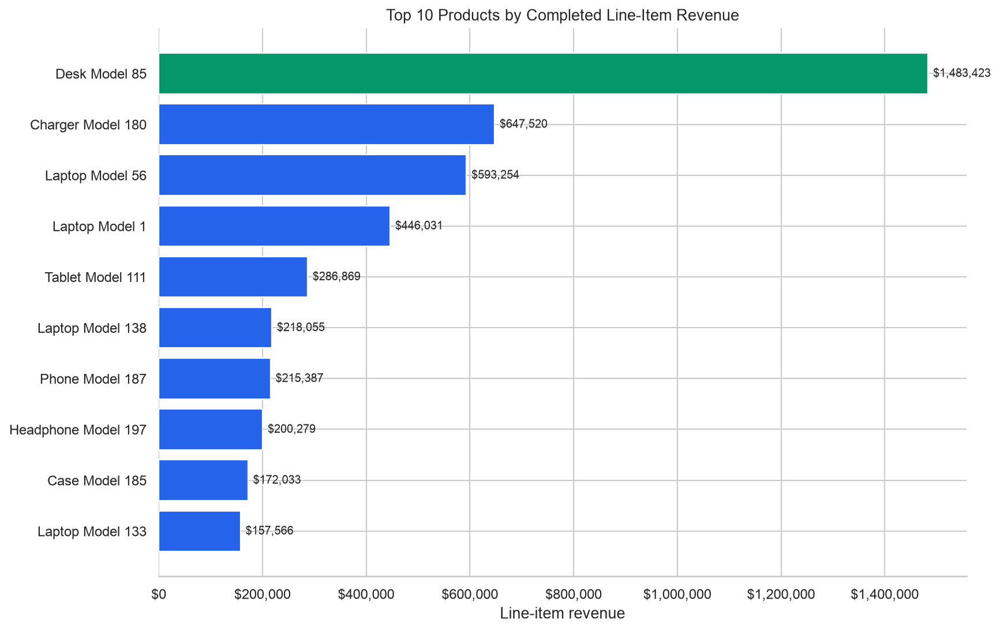

# Python E-commerce Analysis

An end-to-end Python analysis of e-commerce orders, customers, products, and order items, focused on revenue trends, customer behavior, and product performance.

## Key Findings

- Known completed-order revenue totaled **$2.50 million** across 2,979 orders, with an average order value of approximately **$840**.
- Revenue was volatile rather than steadily growing: **June 2023** peaked at **$186,364**, while **April 2024** was the lowest month at **$66,148**.
- The **consumer** segment generated the most order-level revenue at approximately **$965,951**.
- Repeat buyers represented **77.7%** of customers with known completed-order totals.
- **Desk Model 85** led completed line-item revenue at approximately **$1.48 million**, and **Desks** was the top product category.

## Key Visualizations

### Monthly Revenue Trend



### Revenue by Customer Segment



### Top 10 Products



The `charts/` directory also includes revenue by category and an order-activity heatmap.

## Dataset

The project covers transactions from **January 1, 2023 through December 30, 2024** across four CSV files:

| File | Rows | Columns | Description |
|---|---:|---:|---|
| `orders.csv` | 5,020 | 5 | Order dates, statuses, customers, and totals |
| `customers.csv` | 1,200 | 4 | Privacy-safe customer segment, country, and signup data |
| `products.csv` | 200 | 5 | Product names, categories, prices, and costs |
| `order_items.csv` | 9,423 | 5 | Product quantities and unit prices by order |

Direct identifiers were removed from the customer data before publication. The analysis also documents duplicate order IDs, missing order totals, and a mismatch between order-level totals and calculated line-item revenue.

## Stack

- Python 3.12
- Pandas
- NumPy
- Matplotlib
- Seaborn
- Jupyter Notebook

## How to Run

1. Clone the repository and enter the project directory:

   ```bash
   git clone https://github.com/YOUR_USERNAME/python-ecommerce-analysis.git
   cd python-ecommerce-analysis
   ```

2. Create and activate a virtual environment:

   ```bash
   python3.12 -m venv .venv
   source .venv/bin/activate
   ```

3. Install the dependencies:

   ```bash
   pip install -r requirements.txt
   ```

4. Run the notebook:

   ```bash
   jupyter notebook analysis.ipynb
   ```

Run all cells from top to bottom. The notebook recreates every image in `charts/`.

## Repository Structure

```text
python-ecommerce-analysis/
├── README.md
├── requirements.txt
├── analysis.ipynb
├── data/
│   ├── orders.csv
│   ├── customers.csv
│   ├── products.csv
│   └── order_items.csv
└── charts/
    ├── monthly_revenue.png
    ├── revenue_by_category.png
    ├── customer_segments.png
    ├── top_10_products.png
    └── orders_heatmap.png
```
